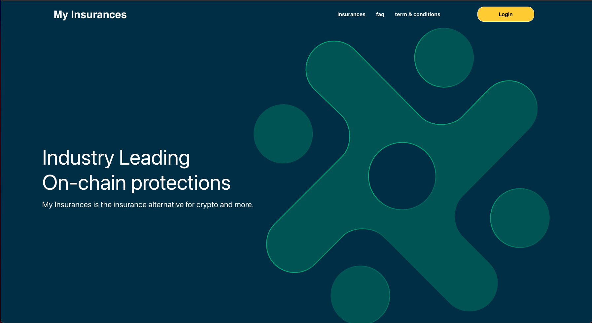
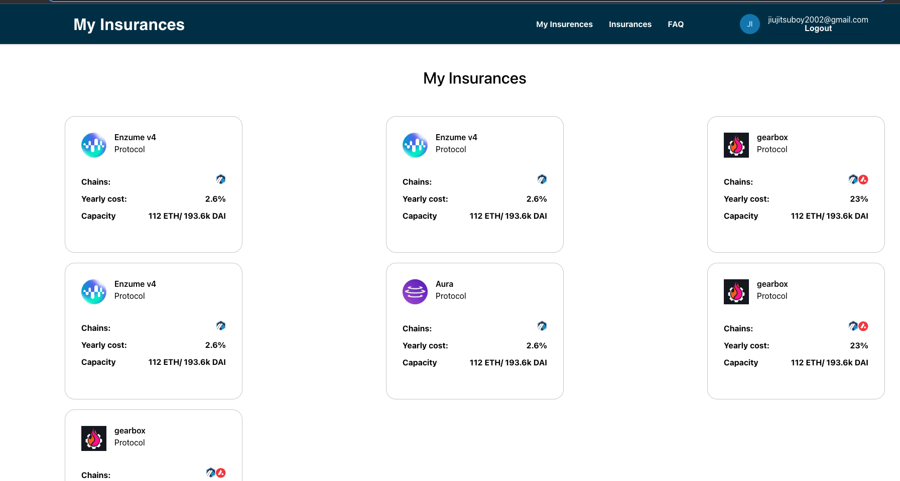
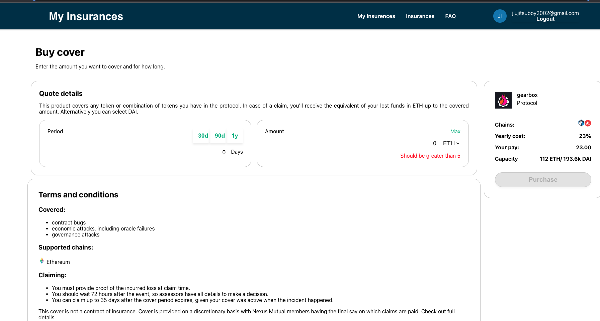
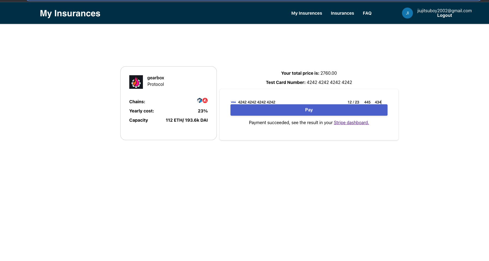
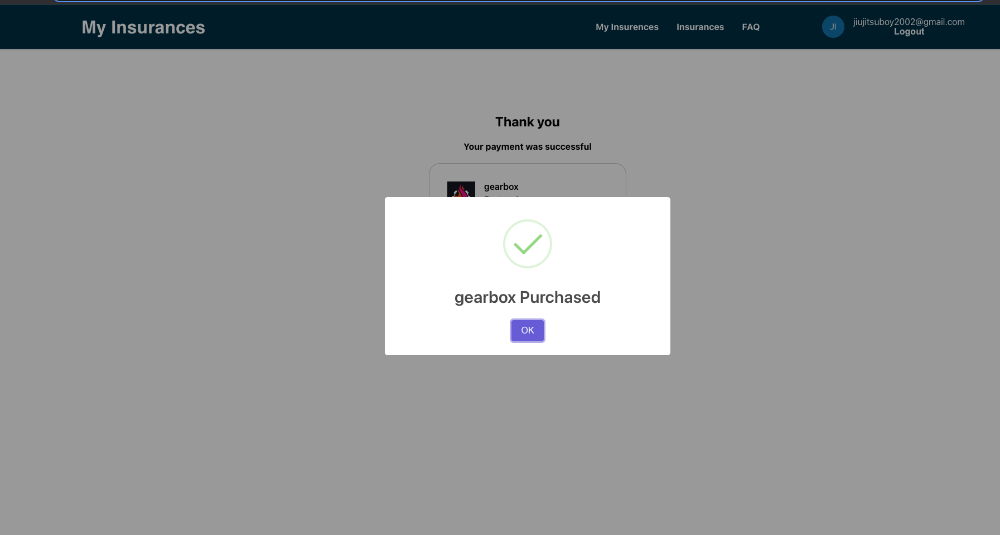
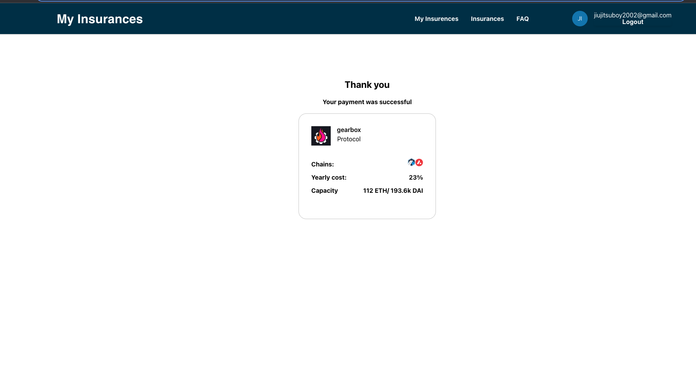
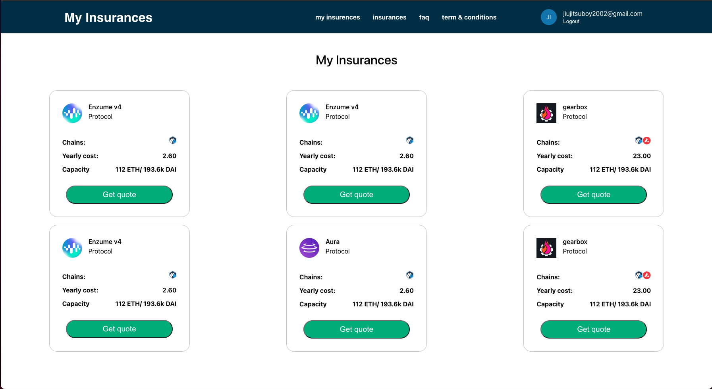
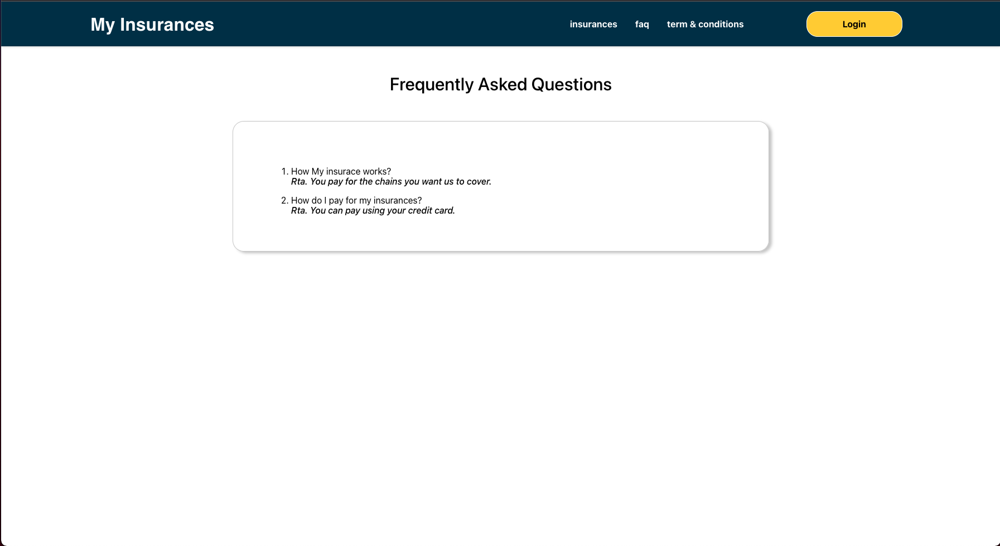
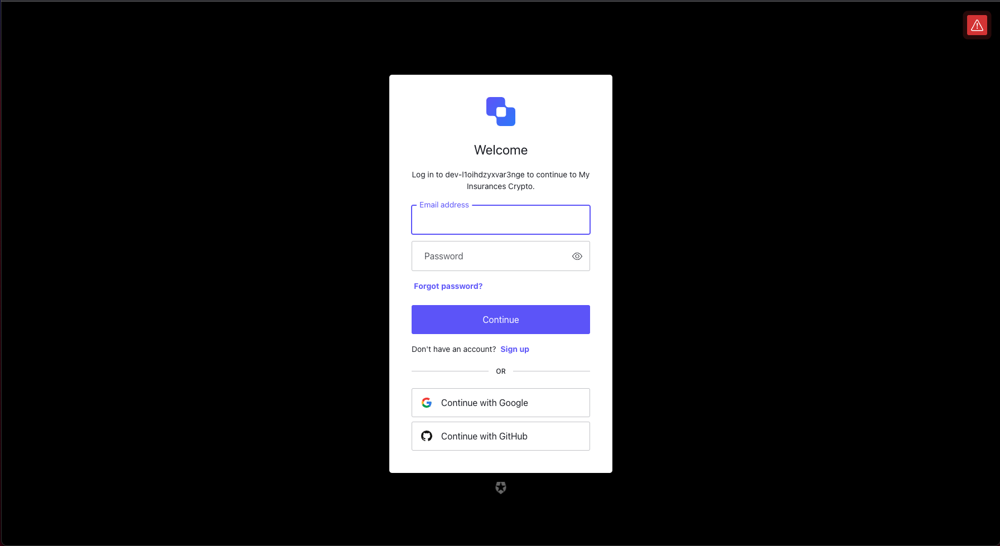
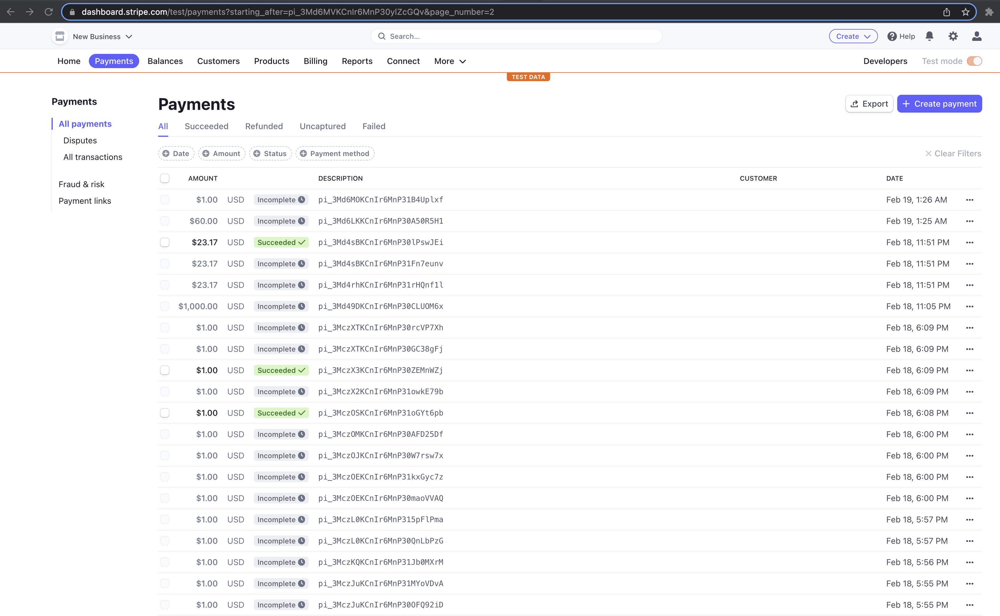

# winkflow

I simple fullstack application that allow people to register and buy coverage for crypto operations.

## Structure

This project use a monorepo structure where we have both the [web](/web) and [api](/api) code in the same repo.

### Web (UI)
The project is composed of following features

* Landing Page: This is the starting point of the project, where you land unathenticated/authenticated

* **Insurance List Page:** Here we find the list of insurances (coverage) offer to our clients.

* **Insurance Detail Page:** Here were you can see how it will cost the insurance and offers the option of purchase.

* **Insurance Checkout Page:** Preview of the insurace you are going to pay. Offer you a payment card method.

* **Insurance Purchase confirmation Page:** Show the summary of the purchase.

* My current Insurances: This is were the logged user, can see his coverage purchased. *This page required the user to be authenticated.*

* FAQ: Frequently Asked Question section

* Login: Auth0 login page

* Stripe dashboard: With your [stripe account](https://dashboard.stripe.com/test/payments), you can see the payments done in the application

### Api (Graphql)
This project use a graphql api to serve all the logic and connection to the persistance layer. [api](http://localhost:4000/graphql) 

Mutation

* createUser(name: String): User!
* createInsurance(insuranceInput: InsuranceInputData!): Insurance!
* createChain(chainInput: ChainInputData!): Chain!
* buyCover(coverInput: CoverInputData!): Insurance

Queries

* getUser(id: Int!): User 
* getUserByName(name: String!): User
* getInsurance(id: Int!): Insurance
* getInsurances(pageNum: IntpageSize: Int): InsurancePaginated
* getChain(id: Int!): Chain
* getChains(pageNum: IntpageSize: Int): ChainPaginated

## Setup
This proyect use the following stack:

- React 18
- Node 18
- mysql
- Auth0
- Stripe API

It is necessary to have a mysql database with the name winkflow

### Auth0

Is required to create an account on [Auth0](https://auth0.com) and create one application (for react) and one API (for node).
The values of the Auth0 Enviroment variables are taken from this applications created under the Auth0 account.

### Stripe
Is required to create an account on [Stripe](https://stripe.com/), The values of the Stripe Enviroment variables are taken from this API SDK.

### For frontend is required the following env variables:

- REACT_APP_STRIPE_PUBLIC_KEY= Strype public key
- REACT_APP_STRIPE_SECRET_KEY= Strype secret key
- REACT_APP_AUTH0_DOMAIN= Auth0 domain name
- REACT_APP_AUTH0_CLIENT_ID= Auth0 client ID
- REACT_APP_AUTH0_AUDIENCE= Auth0 audience

### For backend is required the following env variables:

- DATABASE_URL="mysql://[user]:[password]@[url]/[database_name]"
- AUTH_DOMAIN= Auth0 domain name
- AUTH_CLIENT_ID= Auth0 client ID
- AUTH0_AUDIENCE= Auth0 audience
- STRIPE_SECRET_KEY = Strype secret key
